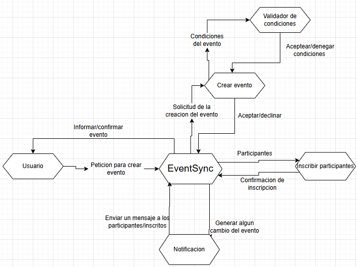
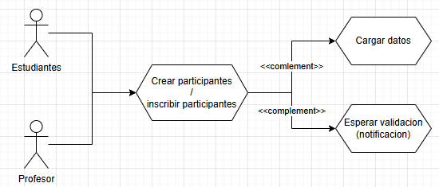
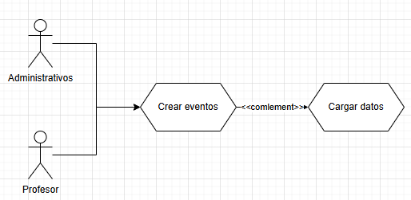

# DOSW_PARCIALT1_RogerDuran

## 1. Diagrama de contexto

## 2. Patrones de diseño
Los patrones los cuales se pueden implementar para dar una solución a este problema de logica son patrones comportamentales, creacionales y entra otro que es el patron adapter, este ultimo dependiendo totalmente de como se realice la entrada y distribucion de datos.

El patron creacional el cual usamos es el factory-method el cual usaremos para la distribucion de distintos canales de desarrollo de eventos, esto dependiento el tipo de evento el cual se este trabajando y como lo estamos haciento apra cada uno de estos mismos.

El patron comportamental que podemos usar es el patron Strategy, el cual nos sirve para optimizar tiempo de ejecucion segun la mejor estrategia a implementar para la notificacion que sea necesaria para el tipo de evento al cual se esta haciendo referencia. Incluso otro patron que podemos aplicar es el de cadena de responsabilidad el cual funciona y es perfecto para la delegacion de responsabilidad hacia los directivos en el encabezado de hackaton.

## 3. Analisis de requerimientos

- Requerimientos funcionales (RF)
    1. RF-01: El sistema debe poder enviar notificaciones siempre que ocurra algo con los eventos registrados.
    2. RF-02: El sistema debe poder inscribir participantes de manera manual (Inscripcion por el usuario).
    3. RF-03: El sistema debe permitir crear un evento sin saltarse las condiciones especificas.

- Requerimientos no funcionales (RNF)
    1. El sistema debe mantener los colores y logo de la universidad. 
    2. El sistema debe ser responsive y manejar la tipografia de la universidad.

## 4. Diagrama de casos de uso e historias de usuario

- RF-02:
    1. _**Como**_ estudiante **_Quiero_** poder inscribirme en un evento **_para_** participar y generar conocimiento a traves de las actividades de este.

    2. **_Como_** profesor **_Quiero_** poder inscribir a mis estudiantes o inscribirme en un evento **_Para_** participar generando conocimiento a mis alumnos. 

- RF-03: 
    1. **_Como_** administrativo **_Quiero_** crear eventos **_Para_** aumentar las actividades y generar aprovaciones dentro de estas mismas al no cumplirse _"x"_ capacidad o requisitos.

    2. **_Como_** Profesor **_Quiero_** crear eventos **_Para_** hacer participar a mis estudiantes de estos y generar o reforzar el conocimiento mediante estos mismo.

## 5.
### 5.1 Requerimiento Funcional 1

| Campo | Descripción |
|------|-------------|
| **ID** | RF-02 |
| **Nombre del requerimiento** | Inscripcion de participantes |
| **Descripción** | *El sistema debe debe poder inscribir participantes de manera manual (Inscripcion por el usuario).* |
| **Precondiciones** | *Para que el sistema cumpla con este requerimiento, EventSync debe poder confirmar que el correo ingresado por el usuario sea de valido para el sistema* |
| **Actor** | *(Profesores y estudiantes)* |
| **Flujo principal** | 1. El actor ingresa los datos para la inscripcion. 2. El sistema debe validar que los datos que ingreso el usuario 3. El sistema debe confirmar la inscripcion o denegacion de esta al usuario. |
| **Diagrama de caso de uso** | **|
| **Poscondiciones** | *Se espera como resultado un mensaje de confirmacion o denegacion de la inscripcion* |

### 5.2 Requerimiento Funcional 2

| Campo | Descripción |
|------|-------------|
| **ID** | RF-03 |
| **Nombre del requerimiento** | Creacion de eventos |
| **Descripción** | *El sistema debe permitir crear un evento sin saltarse las condiciones especificas.* |
| **Precondiciones** | *Para que el sistema cumpla con este requerimiento, EventSync debe poder validar la informacion proporcianada por el creador del evento y junto a esto validar la disponibilidad de este mismo* |
| **Actor** | *(Profesores y administrativos)* |
| **Flujo principal** | 1. El actor debe ingresar los requisitos para crear un evento 2. El sistema debe validar estos datos y verificar disponibilidad 3. El sistema debe confirmar la creacion, eliminacion o modificacion del evento. |
| **Diagrama de caso de uso** | *|
| **Poscondiciones** | *Se espera como resultado que el usuario pueda validar si el evento quedo creado de manera correcta* |

## 6. Descomposicion de tareas asociadas requerimiento RF-02

### Epica:

**_Inscripcion de participante en un evento_**

### Historia de Usuairo:
1. _**Como**_ estudiante **_Quiero_** poder inscribirme en un evento **_para_** participar y generar conocimiento a traves de las actividades de este.

2. **_Como_** profesor **_Quiero_** poder inscribir a mis estudiantes o inscribirme en un evento **_Para_** participar generando conocimiento a mis alumnos. 

### Tareas:
1. Ingreso de datos para la inscripcion.
2. Validacion de identidad segun el correo.
3. Permitir la inscripcion si los requisitos son correctos.
4. Mostrar un mensaje de validacion o negacion de inscripcion.

## 7. Diagrama de clases:

## 8. Implementación:

